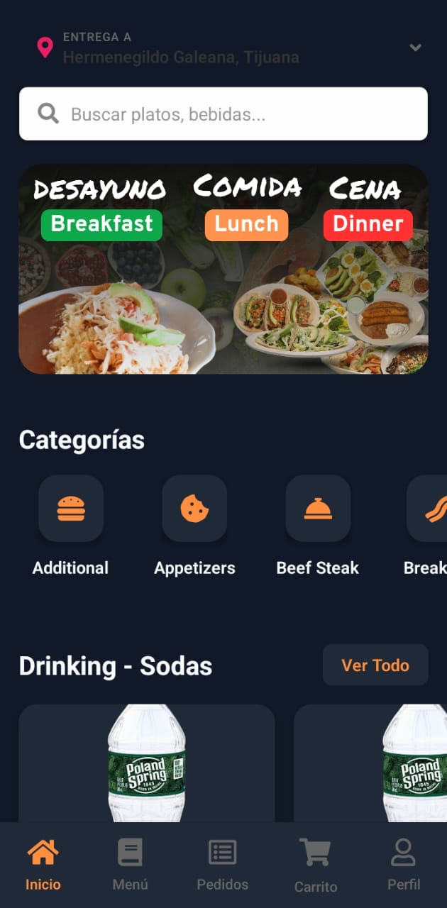
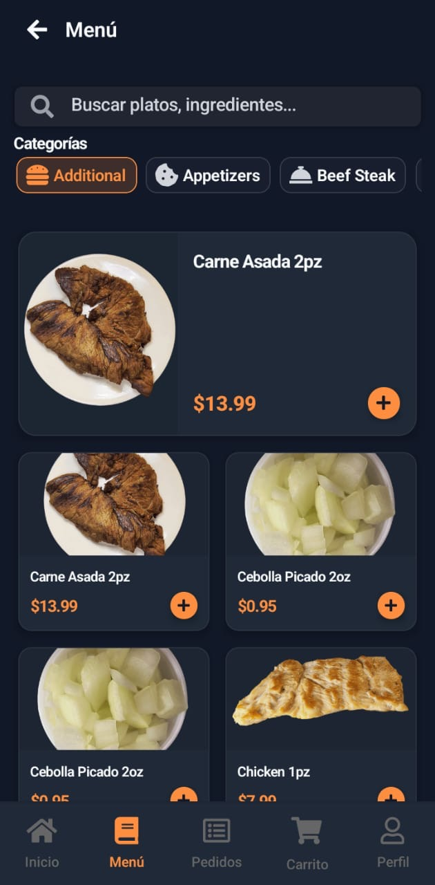

# 🍽️ TU CASA - React Native Restaurant App

<div align="center">
  
  
  
</div>

## 📱 Screenshots

<div align="center">
  
  
  
</div>

<div align="center">
  
  
  
</div>

## 🚀 Features

- 🏠 Beautiful and intuitive home screen with restaurant listings
- 📱 Responsive design for all screen sizes
- 🛒 Shopping cart functionality with real-time updates
- 🔍 Advanced search and filtering by cuisine type
- 👤 User authentication with social login options
- 💳 Secure payment integration with multiple payment methods
- 📱 Push notifications for order updates
- 🌙 Dark mode support for better user experience
- 📍 Location-based restaurant discovery
- ⭐ Rating and review system
- 🎯 Personalized recommendations

## 🛠️ Tech Stack

- React Native
- TypeScript
- Redux Toolkit for state management
- React Navigation for seamless navigation
- Styled Components for beautiful UI
- Axios for API integration
- Firebase for backend services
- Google Maps API for location services
- Stripe for payment processing

## 📦 Installation

1. Clone the repository:
```bash
git clone https://github.com/yourusername/tu-casa-app.git
```

2. Install dependencies:
```bash
cd tu-casa-app
npm install
```

3. Start the development server:
```bash
npm start
```

4. Run on iOS:
```bash
npm run ios
```

5. Run on Android:
```bash
npm run android
```

## 🔧 Environment Setup

Create a `.env` file in the root directory with the following variables:

```env
API_URL=your_api_url
FIREBASE_API_KEY=your_firebase_api_key
GOOGLE_MAPS_API_KEY=your_google_maps_api_key
STRIPE_PUBLISHABLE_KEY=your_stripe_key
```

## 📱 App Structure

```
src/
├── components/     # Reusable components
├── screens/        # Screen components
├── navigation/     # Navigation configuration
├── store/         # Redux store setup
├── services/      # API services
├── hooks/         # Custom hooks
├── utils/         # Utility functions
└── assets/        # Images, fonts, etc.
```

## 🤝 Contributing

1. Fork the repository
2. Create your feature branch (`git checkout -b feature/AmazingFeature`)
3. Commit your changes (`git commit -m 'Add some AmazingFeature'`)
4. Push to the branch (`git push origin feature/AmazingFeature`)
5. Open a Pull Request

## 📄 License

This project is licensed under the MIT License - see the [LICENSE](LICENSE) file for details.

## 👥 Authors

- Your Name - Initial work

## 🙏 Acknowledgments

- React Native community
- All contributors who helped with this project
- Design inspiration from modern restaurant apps
- Special thanks to all the beta testers who provided valuable feedback

---

<div align="center">
  Made with ❤️ by Your Name
</div> 